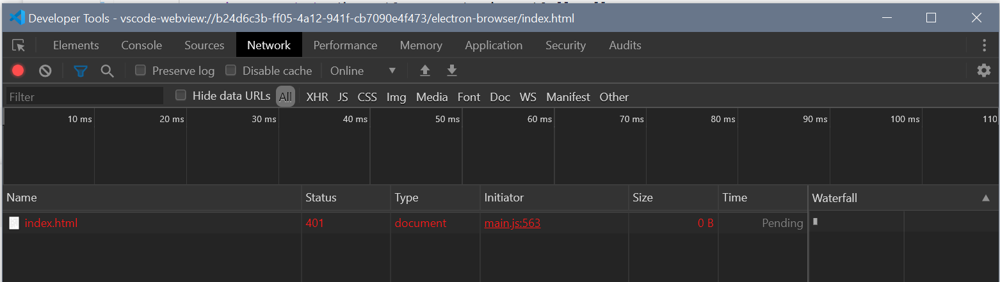

# Repro for vscode issue 101562

Thanks for looking at this repro. This is a minimal repro of this, scaffolded using the `yo code` generator.

## Main components

Please note the following files:

 - frontend/index.html -- this provides the theoretical main user interface for the application
 - src/view.ts -- this initializes a WebView panel in a way that was compatible in VS Code 1.46 but fails in 1.47.
 - src/extension.ts -- minimal implementation to register the `extension.helloWorld` command which calls `View.create()`, which causes the repro.

If you observe this (for instance, by reloading the webview) you receive the following:



The details are:

```
Request URL: vscode-webview-resource://b24d6c3b-ff05-4a12-941f-cb7090e4f473/b24d6c3b-ff05-4a12-941f-cb7090e4f473/file///f%3A/proj/webview-load-problem/frontend/index.html
Request Method: GET
Status Code: 401 Unauthorized
Referrer Policy: no-referrer-when-downgrade
```
